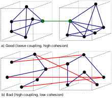

# Quote Machine

* Status: Proposta <!-- optional -->
* Envolvidos: Henrique Gurgacz, Luiz Perin
* Decisores: Fred Ferreira, Andrea Gutierrez <!-- optional -->
* Data: 27/12/2023 <!-- optional -->

O time de arquitetura foi envolvido em 27/12/2023 referente a um projeto já iniciado chamado "Solução de Compras Quote Machine".

O projeto numerado como PRJ-57 já possui o fornecedor Accenture contratado e mobilizado com escopo fechado. O projeto está neste momento em fase de refinamento e detalhamento de escopo. O projeto envolve algumas customizações no SAP, especialmente no módulo de compras e na customização já construída chamada RobôBuyer. Abaixo pode ser vista a lista de melhorias e customizações do projeto 

| **Descrição**                    | **Tipo**        | **Complexidade** |
|----------------------------------|-----------------|------------------|
|Configuração do Processo Standard para utilização da cotação SAP|FD - CUSTOMIZING|Baixo|
|Desenvolvimento de lista de vendor para geração de cotação|FD - ENHANCEMENT|Média|
|Configuração de LOF|FD - CUSTOMIZING|Baixo|
|Configuração de Registro Info automatico|FD - CUSTOMIZING|Baixo|
|Desenvolvimento de automatização de geração de cotação atraves do cockpit gerando numeração da rfqcolet automaticamente|FD - ENHANCEMENT|Média|
|Criar cockpit de controle de envio de cotação|FD - INT PI SYNC|Média|
|PI Inbound: Interface PI para disparo de decomento de cotação através do SAP comunicação com portal de compras|FD - INT PI SYNC|Baixo|
|Desenvolvimento de smartforms para gerar contação e envio do documento para fornecedor	|FD - FORM|Baixo|
|PI Outbond interface PI para retorno dos dados recebidos dos fornecedores (1-aceito, 2- declinado) se aceito, respondido no prazo (sim/não), se respondo no prazo, integrar informações da cotação no sap, se não respondido no prazo não integrar e descartar a cotação com motivo: fora do prazo|FD - INT PI SYNC|Média|
|Cockpit - ao fim das cotações efetuar a comparação dos valores unitários brutos e mostrar para decisão do comprador o ranking das cotações - após definição do vencedor, criar pedido de compras a partir da cotação vencedora|FD - ENHANCEMENT|Baixo|
|construção de portal comprar para armazenamento de link ou form para responder RFPs.|FD - ENHANCEMENT|Alta|

## Contexto e declaração do problema
De acordo com o DPJ do projeto existe um requisito da disponibilização de um portal web público, onde os fornecedores poderão responder questionários e submeter as cotações.

De acordo com a análise de aderência já realizada pela área de negócio, os sistemas SAP Ariba e outras soluções de mercado não atendem a esse requisito ou envolvem compra de licenciamento e alto custo para a Eneva.

Desta forma a criação do Portal público envolverá um desenvolvimento que traz uma série de questionamentos que estão sendo feitos neste momento (27/12/2023) para o BP (Luiz Perin) e o Fornecedor, são eles:
- O desenvolvimento do Portal usará alguma solução nativa da plataforma SAP, como por exemplo o SAP Portal? Neste cenário foi avaliado se temos licenciamento para utilização de tal solução?
- O desenvolvimento do Portal envolverá a construção de uma aplicação fora da plataforma SAP? Neste cenário o time de arquitetura possui uma série de recomendações e direcionadores arquiteturais que precisam ser utilizados.
- Já existe um desenho de solução proposta para o projeto? O desenho alto nível já pode ser compartilhado?
- Como trata-se de um escopo fechado com o fornecedor Accenture, importante garantir que o projeto envolva entregáveis técnicos tais como: Desenho de arquitetura do projeto, diagrama de integrações, documentação técnica de customizações, documentação de desenvolvimento e entrega do código fonte. 

## Motivadores de decisão

Ainda não é possível definir nenhuma decisão arquitetural para o projeto visto as dúvidas apresentadas na sessão acima.

Detoda forma,  considerando  um cenário onde será realizado o desenvolvimento de uma nova solução web fora da plataforma SAP, os seguintes aspectos e direcionadores arquiteturais precisarão ser considerados:
- O fornecador deverá ter conhecimento em Github para manter o código versionado, de Github Actions para criação do pipeline DevOps da aplicação e também de Github Packages para armazenar os pacotes gerados;
- O fornecedor será responsável pela criação dos pipelines DevOps tanto de deploy quanto de rollback;
- O desenvolvimento deverá ser feito utilizando separação de branchs no GitHub. Ou seja, branch de desenvolvimento, produção e homologação (caso seja necessário). Onde essas branchs são bloqueadas de alteração direta e somente aceitam novas features através de pull requests;
- Aplicação deverá rodar em ambiente linux, conteinerizado na cloud Azure ou GCP. A imagem do conteiner deverá estar armazenada no Github Packages;
- O container deverá ser stateless e não usar nenhum tipo de armazenamento local. Caso seja preciso armazenar arquivos, eles deverão algum serviço de núvem tipo BlobStorage ou CDN que deverão ser escolhidos de acordo com ojetivo final.
- Desenvolvimento do frontend deverá utilizar um framework web atual: Angular ou React;
- O código gerado deverá possuir testes unitários e de integração com um coverage de no mínimo 80%;
- Arquivos de configuração não podem, de forma alguma, possuir chaves de segurança (passwords) em texto. Essas chaves devem utilizar algum serviço de núvem para seu armazenamento (keyvault);
- É ideal que o fornecedor não tenha acesso direto aos recursos da cloud, toda iteração com o ambiente deverá ser feita pelo pipeline DevOps no Github Actions;
- A solução (Portal web) poderá chamar diretamente as APIs SAP
- A aplicação deverá possuir políticas de reenvio de eventos para API em caso de falhas;
- É obrigatório um sistema de notificação. Qualquer falha no envio ou recebimento de informações pela API deverá notificar os usuários responsáveis. Estes usuários deverão ser cadastrados através de uma tela web na aplicação criada;
- A aplicação deverá usar autenticação vinculada com o AD da Eneva. Utilizando padrão OAuth2 ou similar;
- A aplicação deverá possuir um sistema de log adequado.

Pontos de atenção internos para o time de arquitetura:
- Definir qual núvem será usada: GCP ou Azure (pelo time de arquitetura, Azure seria uma opção satisfatória);
- Conectividade GCP/Azure com o ambiente atual da aplicação desenvolvida na fase 1.
- Contratação de ferramenta de APM/Logging (Elastic, Datadog...): Essas ferramentas ajudam na observabilidade de aplicação dando visibilidade e rastreamento de erros. Além de permitir um sistema de log bem robusto;
- Ferramenta para análise de código: Estática como Dinâmica (SAST/DAST): Garantem uma maior segurança do código que foi gerado;
- Ferramenta para análise de vulnerabilidade de containers: Analisam falhas de segurança nos containers.
